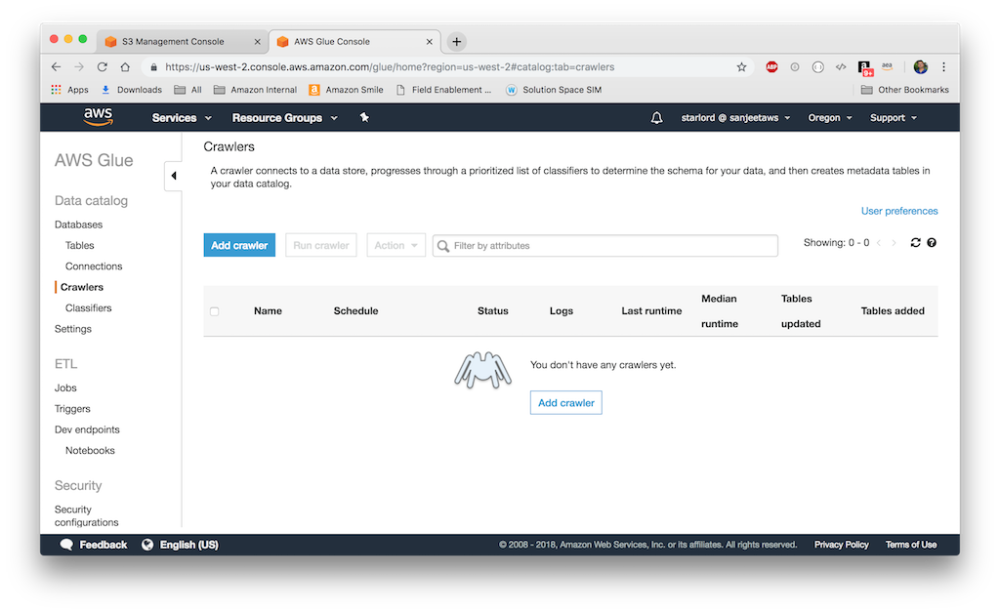

# Overview
Come and learn how to leverage Amazon S3, Amazon Glue, Amazon Athena and Amazon QuickSight to upload a dataset to your central data lake, automate the creation of a data catalog, transform data to a compressed columnar format that allows to speed up and reduce the cost of your processes, query the data using standard SQL and create and share rich web-based visualizations. Do this all without having to manage clusters or having to spin up a single instance.

https://reinvent.awsevents.com/learn/builders-sessions/

Builders Sessions are back at re:Invent this year by popular demand. Builders Sessions are 60-minute small groups sessions with up to five customers and one AWS expert, who is there to help, answer questions, and provide guidance. It’s just you, your laptop, and the AWS expert.

Each builders session begins with a short explanation or demonstration of what you are going to build. There will not be any formal presentation. Once the demonstration is complete, you will use your laptop to experiment and build with the AWS expert.

# Architecture
Amazon S3 > AWS Glue > Amazon Athena > Amazon QuickSight

# Step 1: Upload dataset to Amazon S3
The first step towards building this demo allows you to find and upload a publically available dataset to your private bucket. This bucket will serve as a data lake where you can ingest data coming from different sources e.g. structured or unstructured data coming from your real world applications in different formats e.g. json, csv, avro, parquet etc. in either compressed e.g. gzip, snappy etc. or uncompressed state. In this demo, we will use a single csv file (~750MB) that we'll source from a public dataset hosted on S3.

## 1.1 Finding a dataset
Data of trips taken by taxis and for-hire vehicles in New York City.
https://registry.opendata.aws/nyc-tlc-trip-records-pds/

The yellow and green taxi trip records include fields capturing pick-up and drop-off dates/times, pick-up and drop-off locations, trip distances, itemized fares, rate types, payment types, and driver-reported passenger counts. The data used in the attached datasets were collected and provided to the NYC Taxi and Limousine Commission (TLC) by technology providers authorized under the Taxicab & Livery Passenger Enhancement Programs (TPEP/LPEP). The  trip data was not created by the TLC, and TLC makes no representations as to the accuracy of these data.

## 1.2 Listing and uploading the data to your own private S3 bucket
The public dataset is uploaded in a public S3 bucket here:
```
s3://nyc-tlc
```
I used a Mac for this project and on the terminal window, I executed the following command to list all the contents of the S3 bucket. Please note, you will be able to execute the following command only if AWS CLI is installed and configured on your laptop (see appendix for details)
```
$ aws s3 ls "s3://nyc-tlc/trip data/" --summarize --human-readable

```
After listing all the contents and understanding the folder structure, I decided to use the data available for November 2018 by uploading it to my private S3 bucket. The following command allowed me to copy the contents over to my bucket directly from the source bucket
```
$ aws s3 cp "s3://nyc-tlc/trip data/yellow_tripdata_2018-06.csv" s3://s6r8/ds-csv/nyc-tlc/
```

# Step 2: Automate the creation of a Data Catalog
This step will allow us to use AWS Glue to build a data catalog that we'll configure to run every hour to ensure that all data ingested into our data lake is automatically catalogged. A data catalog consists of one or more Glue databases each having one or more tables for each dataset. In this demo, we'll create 1 Glue database that will contain 1 table for our dataset that has 1 csv file. There are 2 ways of creating a Glue table: manually, by defining a custom schema or by using a Glue Crawler that crawls the dataset to determine the schema automatically.

## 2.1 Add a Crawler
Click on the blue button "Add crawler"


### 2.1.1 Crawler Info
Specify a name. In the screenshot, I have used s6r8n6 as a shorthand for a rather verbose name that I was planning to use earlier: sahays-reinvent-nyctlc. Check "create a single schema for each S3 path" to tell the crawler to group compatible schemas into a single table definition


### 2.1.2 

# Step 3: Transform data into a compressed columnar format

# Step 4: Query the data using standard SQL

# Step 5: Create and Share rich web-based visualizations


# Appendix:
https://github.com/Deutsche-Boerse/dbg-pds/commit/c28a52154adf293832dd718b52c395928ea745ff
Installing the AWS CLI
https://docs.aws.amazon.com/cli/latest/userguide/installing.html
I prefer to use Homebrew for a Mac
https://github.com/aws/aws-cli/issues/727
Configuring the AWS CLI
https://docs.aws.amazon.com/cli/latest/userguide/cli-chap-getting-started.html
Copy objects between S3 buckets
https://aws.amazon.com/premiumsupport/knowledge-center/move-objects-s3-bucket/


Create a QuickSight Account
Choose Standard
https://registry.opendata.aws/deutsche-boerse-pds/
https://github.com/Deutsche-Boerse/dbg-pds
https://github.com/Deutsche-Boerse/dbg-pds/commit/c28a52154adf293832dd718b52c395928ea745ff
$ aws s3 cp s3://deutsche-boerse-xetra-pds/ s3://s6r8/ds-csv/xetra/2018-11/ \
--recursive --exclude "*" --include "2018-11-*"

ALTER TABLE xetra_2018_11_01_bins_xetr08_csv SET LOCATION 's3://s6r8/ds-csv/xetra/2018-11';

select securitydesc, securityid, avg((maxprice - minprice) / minprice) as implied_vol from xetra_2018_11_01_bins_xetr08_csv
group by securitydesc, securityid
order by implied_vol desc

select avg(endprice) as price, securitydesc 
from xetra_2018_11_01_bins_xetr08_csv
group by securitydesc
order by price desc;

select sum(numberoftrades) as trades, securitydesc 
from xetra_2018_11_01_bins_xetr08_csv
group by securitydesc
order by trades desc;