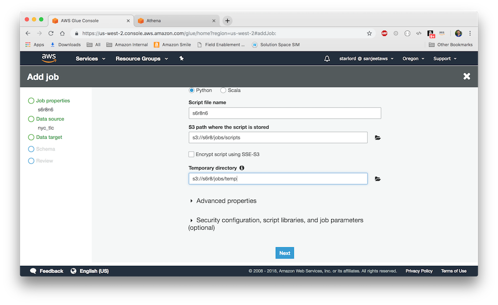
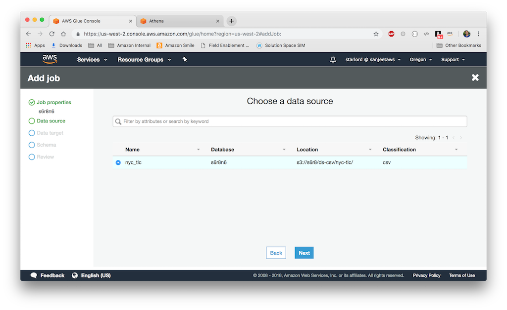

# Step 3: Transform data into a compressed columnar format
We'll use AWS Glue Jobs to perform this step. A job is your business logic required to perform extract, transform and load (ETL) work. Job runs are initiated by triggers which can be scheduled or driven by events. The data store in your S3 bucket contains data in csv format. In this step, we'll use AWS Glue Jobs to transform the csv data into Parquet which is columnar and compressed data format. Columnar data results in a faster query performance and compression helps Athena to scan a smaller amount of data in S3 to output the same result.

## 3.1: Add a job
Click on the "Jobs" menu in the left side panel. Click on "Add job" button to start adding a new job using a wizard.

## 3.1.1: Configure the job properties
Specify a name for the job. Choose the same IAM role that you used to create the crawler in Step 2. Accept the default values for "This job runs", and "ETL Language". We'll allow this Job wizard to create a python script for us that will transform CSV into Parquet. 


Script name is auto populated with the name of the Job. Specify "S3 path where the script is stored" as a folder inside the S3 bucket that you created in Step 1. I have used "jobs/scripts" key to store the scripts generated by this job, and "jobs/temp" for storing any temporary files that the job needs to create.


## 3.1.2: Choose a data source
This step in the wizard allows you to pick a Glue metatdata table that acts as the source of data that the job will use to transform to a target data format. I have picked the only table that the crawler created in Step 2.


## 3.1.3: Choose a data target
In this step, I have used the following values
```
Data Store: Amazon S3
Format: Parquet (this is the target format we are trying to transform the CSV into as a result of this job run)
Target path: <your-s3-bucket>/ds-pq/nyc-tlc
```


## 3.1.3: Review or modify the source/target column mapping
This step allows you to modify or review the source and the target columns mapping. 


## 3.1.4: Review the job summary
This step allows you to modify or review the source and the target columns mapping. 


## 3.1.2: Modify IAM policy
