# Step 2: Automate the creation of a Data Catalog
This step will allow us to use AWS Glue to build a data catalog that we'll configure to run every hour to ensure that all data ingested into our data lake is automatically catalogged. A data catalog consists of one or more Glue databases each having one or more metadata tables for each dataset. In this demo, we'll create 1 Glue database that will contain 1 table for our dataset that has 1 csv file. There are 2 ways of creating a Glue table: manually, by defining a custom schema or by using a Glue Crawler that crawls the dataset to determine the schema automatically. For this session, we are going to automate the creation of the data catalog by using a crawler.

## 2.1: Add a Crawler
A crawler connects to a data store, progresses through a prioritized list of classifiers to determine the schema for your data, and then creates metadata tables in your data catalog. A classifier determines the schema of your data. You can use the AWS Glue built-in classifiers or write your own. Today, we will use Glue built-in classifiers.

Click on the blue button "Add crawler"

### 2.1.1: Crawler Info
Specify a name. In the screenshot, I have used s6r8n6 as a shorthand for a rather verbose name that I was planning to use earlier: sahays-reinvent-nyctlc. Check "create a single schema for each S3 path" to tell the crawler to group compatible schemas into a single table definition
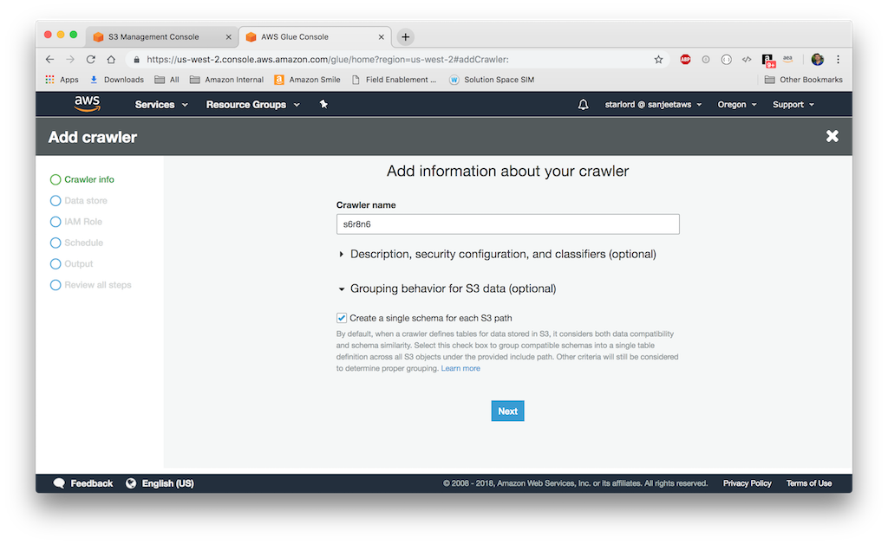

### 2.1.2: Add a data store
Use the S3 bucket name where you copied the public dataset in the Step 1.3 above. Tip: You can use the folder icon to browse to the bucket/folder
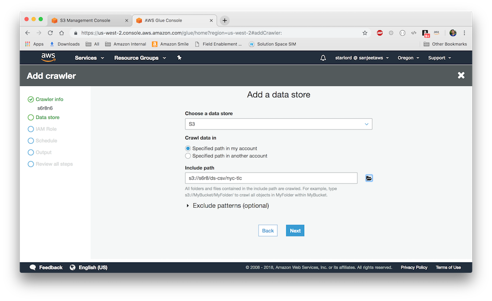

In the next screen accept the default
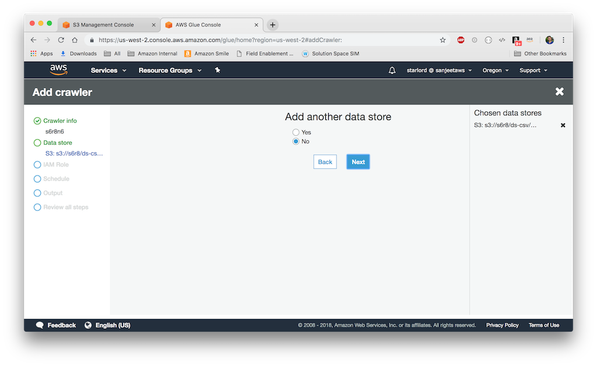

### 2.1.3: Choose an IAM role
Pick an IAM role (existing or new) that this wizard will use to attach AWSGlueServiceRole managed policy to the role besides attaching an inline policy that allows the role access to the S3 data store bucket/folder that you specified in the previous step. For this session, I have chosen to create a new IAM role for the crawler
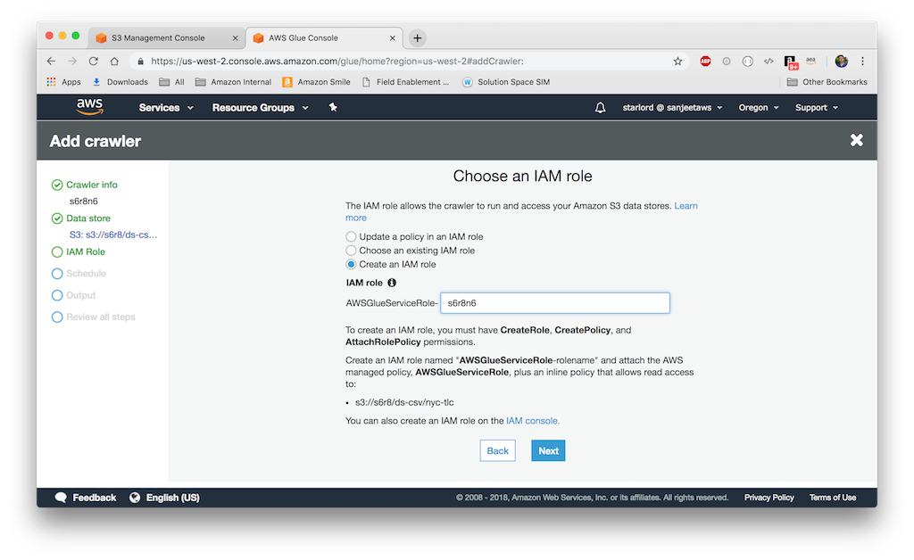

### 2.1.4: Create a schedule for the crawler
You have the option to "Run on demand", specify a named schedule e.g. hourly or specify a cron expression for a custom schedule. For this session, I have chosen "Hourly"
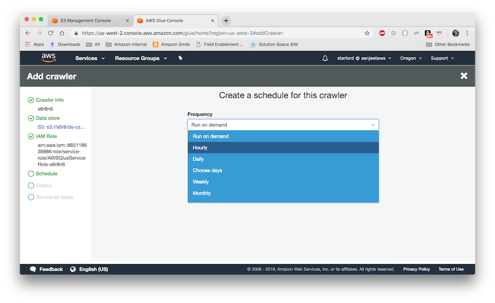

### 2.1.5: Configure the crawler's output
Next step is configure the crawler's output to Glue database. We have the option of using an exiting database or adding a new. 
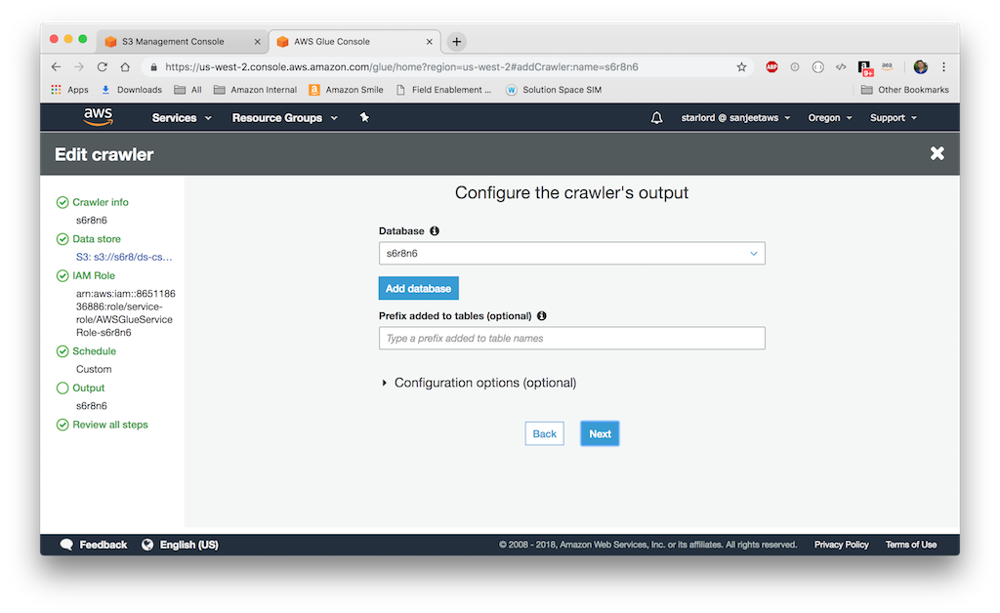

We'll add a new database by clicking on the "Add database" button
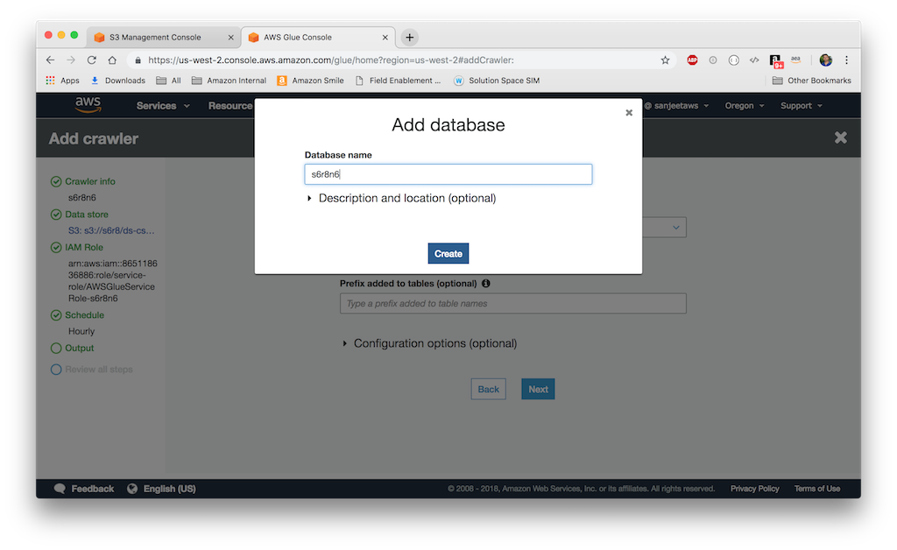

### 2.1.6: Review the steps and finish
Finally, review the summary and then click on Finish to start creating the crawler
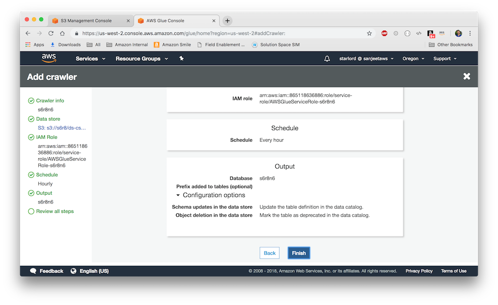

### 2.1.7: Run crawler
Click on the "Crawlers" menu in the left side panel to view a list of all the crawlers. Select the crawler that we created and then click on the button "Run crawler". The crawler will now run, and after about 2 minutes it will finish outputting a new Glue database and a metadata table containing a schema that the crawler created after crawling through the data store.
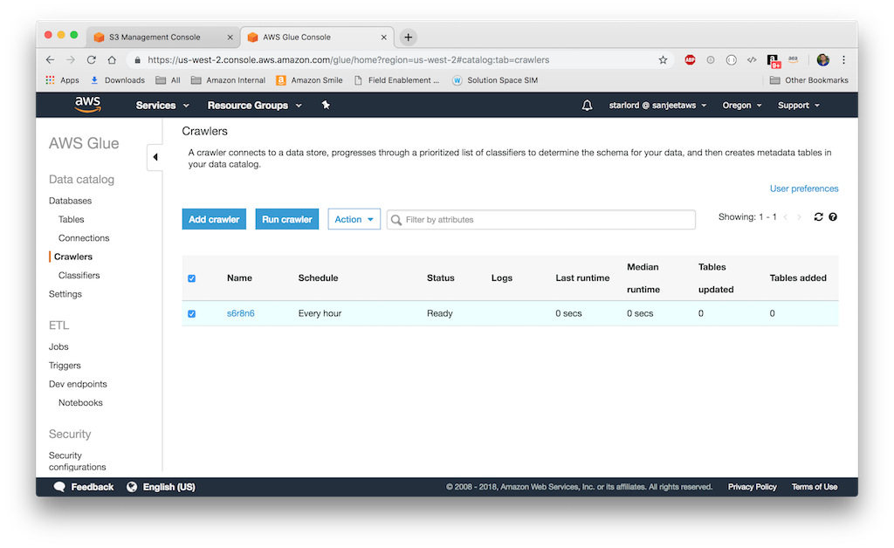

### 2.1.8: Review the metadata table
A table is the metadata definition that represents your data, including its schema. Click on the "Tables" menu in the left side panel to view a list of tables.

Then, select the table to view it's details
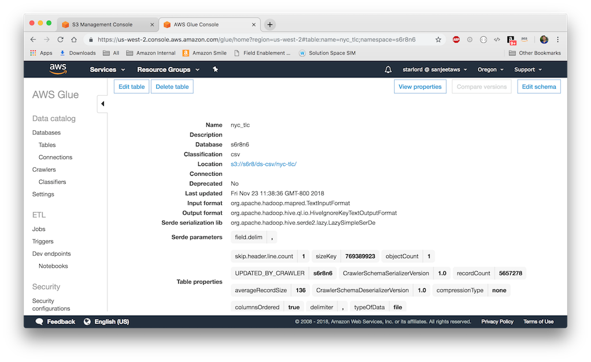

and finally, review the schema that is generated by the crawler

### 2.1.9: Use Athena to query the data store
Select your table from the list of tables and then click on "View Data". This launches Amazon Athena console with a default query that outputs 10 rows from using the table schema from the data store in your private bucket in S3
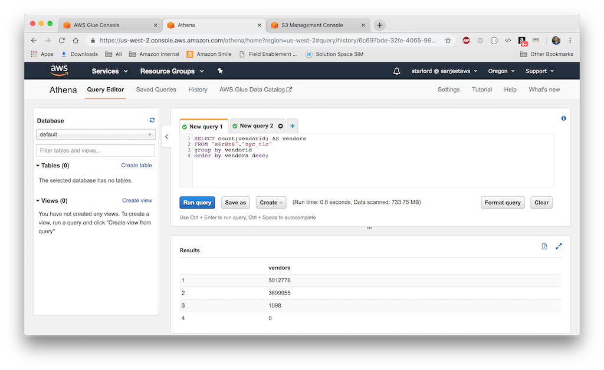

[<< Back](README.md)